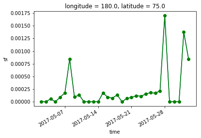
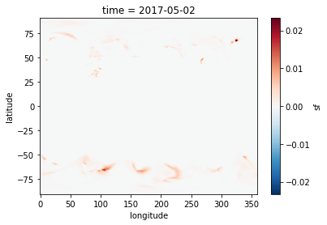
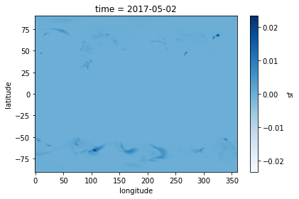
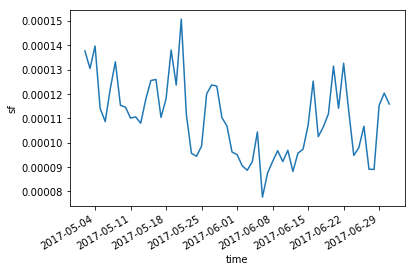

## Multi-dimensional Arrays
N-dimensional arrays can require clever use of matrix algebra to summarize data across spatial and temporal dimensions. Here we will explore HDF5 and NetCDF data structures.

Xarray is the package that we will explore in this notebook, xarray extends the functionality of the Pandas library notably including operations over named dimensions, selection by label instead of integer location, the powerful groupby functionality, and database-like joins. 

We use xarray if the data is multidimensional, if structured on regular grids and data can be represented in the netCDF format. NetCDF forms the basis of the xarray data structure, two main data structures are the DataArray and the Dataset. The DataArray is xarray's implementation of a labeled, multi-dimensional array. 

data: N-dimensional array (numpy or Dask) holding the array's values. 

dims: dimension names for each axis. 

coords: dictionary-like container of arrays that label each point.

attrs: ordered dictionary holding metadata. 


```python
import xarray as xr
```

Open the dataset


```python
ds = xr.open_dataset('testGeospatialData.nc')
ds

```


    <xarray.Dataset>
    Dimensions:    (latitude: 241, longitude: 480, time: 61)
    Coordinates:
      * longitude  (longitude) float32 0.0 0.75 1.5 2.25 3.0 3.75 4.5 5.25 6.0 ...
      * latitude   (latitude) float32 90.0 89.25 88.5 87.75 87.0 86.25 85.5 ...
      * time       (time) datetime64[ns] 2017-05-02 2017-05-03 2017-05-04 ...
    Data variables:
        istl1      (time, latitude, longitude) float64 256.8 256.8 256.8 256.8 ...
        istl3      (time, latitude, longitude) float64 262.9 262.9 262.9 262.9 ...
        sf         (time, latitude, longitude) float64 6.431e-06 6.431e-06 ...
    Attributes:
        Conventions:  CF-1.6
        history:      2017-08-25 22:15:19 GMT by grib_to_netcdf-2.4.0: grib_to_ne...


Extracting DataArrays from a Dataset
DataArray is similar in convention to a numpy array
Datasets are the multidimensional equivalent to a Pandas dataframe. 
## Label-based indexing
Indexing is used to select specific elements from xarray files. Let's select some data from the 2-meter temperature DataArray. We know from the previous lesson that this DataArray has dimensions of time and two dimensions space (latitude and longitude). 

I will use positional indexing


```python
ds['sf'][0,0,0]
```


    <xarray.DataArray 'sf' ()>
    array(6.430538268480113e-06)
    Coordinates:
        longitude  float32 0.0
        latitude   float32 90.0
        time       datetime64[ns] 2017-05-02
    Attributes:
        units:          m of water equivalent
        long_name:      Snowfall
        standard_name:  lwe_thickness_of_snowfall_amount


One challenge of this approach is that it is not simple to associate an integer index with something meaningful. 
For example, we have to write some function to map a specific date in the time dimension to its associated integer. Therefore, xarray lets us perform positional indexing insead of integers.


```python
ds['sf'].loc['2017-05-02',:,:]
```


    <xarray.DataArray 'sf' (latitude: 241, longitude: 480)>
    [115680 values with dtype=float64]
    Coordinates:
      * longitude  (longitude) float32 0.0 0.75 1.5 2.25 3.0 3.75 4.5 5.25 6.0 ...
      * latitude   (latitude) float32 90.0 89.25 88.5 87.75 87.0 86.25 85.5 ...
        time       datetime64[ns] 2017-05-02
    Attributes:
        units:          m of water equivalent
        long_name:      Snowfall
        standard_name:  lwe_thickness_of_snowfall_amount


As an aside, .loc is used in the form DataFrame.loc and is purely a label-location based indexer for selection by label. This is good, we still need to keep track of our index position for the snow fall. What is nice about xarray is that we can look up our dimension by name instead of position. 


```python
ds['sf'].isel(time = 0, latitude = 0, longitude = 0)
```


    <xarray.DataArray 'sf' ()>
    array(6.430538268480113e-06)
    Coordinates:
        longitude  float32 0.0
        latitude   float32 90.0
        time       datetime64[ns] 2017-05-02
    Attributes:
        units:          m of water equivalent
        long_name:      Snowfall
        standard_name:  lwe_thickness_of_snowfall_amount


Here, the isel method refers to a selection by integer position. Finally, we can combine the benefits of both a labeled index and a named dimension as follows.  


```python
ds['sf'].sel(time = '2017-05-02', latitude = 90.0, longitude = 0)
```


    <xarray.DataArray 'sf' ()>
    array(6.430538268480113e-06)
    Coordinates:
        longitude  float32 0.0
        latitude   float32 90.0
        time       datetime64[ns] 2017-05-02
    Attributes:
        units:          m of water equivalent
        long_name:      Snowfall
        standard_name:  lwe_thickness_of_snowfall_amount


## Now we will explore plotting Xarray
Plotting in one dimension.
Let's start visualizing some of the data, we will create a new variable for plotting, a one-dimensional time series. 


```python
timeseries = ds['sf'].sel(time = slice('2017-05-02', '2017-06-02'), latitude = 75.0, longitude = 180.0 )
```

Xarray has some tools to enable quick visualizations of data. 


```python
%matplotlib inline
timeseries.plot()
timeseries.plot.line(color = 'green', marker = 'o')
```


    [<matplotlib.lines.Line2D at 0x111451d68>]





Now we will plot in two dimensions 


```python
map_data = ds['sf'].sel(time = '2017-05-02T0:0:0')

```


```python
map_data.plot()
```


    <matplotlib.collections.QuadMesh at 0x1122c8898>





Customization can occur following standard matplotlib syntax.


```python
import matplotlib.pyplot as plt 
map_data.plot(cmap = plt.cm.Blues)
plt.ylabel('latitude')
plt.xlabel('longitude')
plt.tight_layout()
plt.show()
```





## GroupBy Processing
We often want to build a time series of change from spatially distributed data. For example, suppose we need to plot a time series of the global average air temperature, or snow fall across a period of our climate data record. To accomplish this, xarray has powerful groupby processing tools, similar to the GROUP BY processing used in SQL, in all cases we need to split the data, apply a function to independent groups, and combine back into a known data structure. 
### Groupby Processing: Split
We can group by the name of a variable or coordinate. Either returns an xarray groupby object:


```python
ds['sf'].groupby('time')
```


    <xarray.core.groupby.DataArrayGroupBy at 0x1122fa240>


### Groupby Processing: Apply
Next, we apply a function across the groupings set up in the xarray groupby process. When providing a single dimension to the groupby command, apply processes the function across the remaining dimensions. 


```python
def mean(x):
    return(x.mean())
```


```python
ds['sf'].groupby('time').apply(mean).plot()
```


    [<matplotlib.lines.Line2D at 0x112bf05c0>]





However, there is an even more terse way to express this:


```python
ds['sf'].groupby('time').mean().plot()
```


    [<matplotlib.lines.Line2D at 0x112bc1518>]


## Side Note: 
### Out-of-core computation
Handling large grids, when xarray carries out processing on an array it must load it into memory, many datasets are too large for this on typical devices. Xarray does have a fix for this, xarray integrates with a parallel computing library called Dask. Dask uses task scheduling and blocked algorithms to enable processing of datasets that fit on disk even if they do not fit in memory.  

dask.array = numpy + threading

dask.bag = map, filter, toolz + threading

dask.dataframe = pandas + threading 


#### Opening multiple netCDF files and using Dask
We will use the mfdataset option that enables multiple files as a single xarray dataset. This automatically invokes the dask functionality:
ds  = xr.open_mfdataset('<root_dir>*_samplefile.nc', chunks = {'time':10})


Chunk sizes: a good rule of thumb is around a million elements. 
When we carry out any processes on the Dataset, dask will be invoked, thus it is wise to include the ProgressBar tool from dask.diagnostics to track the processing: 


```python
from dask.diagnostics import ProgressBar
#with ProgressBar():
    #ds.sst.groupby('time.year').mean().plot()
```

### Miscellaneous
Optimization tips: do spatial or temporal indexing (.sel() or .isel()) before groupby() or resample().


```python

```
